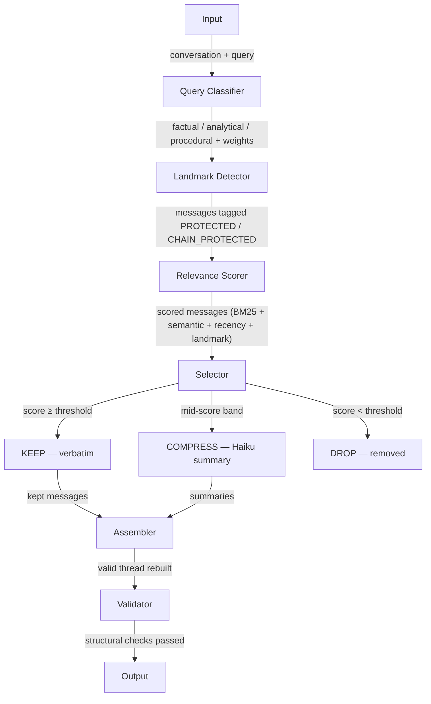

# Context Optimizer — Intelligent Context Window Management

Multi-stage pipeline that optimises long conversation contexts for LLM queries. Given a 50+ message conversation and a user query, produces an optimised context that is **40–60% smaller** while maintaining **equal or better answer quality**.

Built as a standalone pipeline service — designed to integrate with multi-agent platforms where long agent sessions accumulate context that degrades quality and inflates cost.

> Context rot — the gradual degradation of response quality as irrelevant history crowds the context window — is a real production problem in long-running agent sessions. A coding agent processing 10 tool calls per mission can hit 50+ context messages within a single mission. This pipeline sits between the conversation history and the next LLM call and fixes that.

## Architecture



## How It Works

A request arrives with a full conversation history and a query. The pipeline processes it in seven stages, each with a single responsibility:

**1. Query Classification** — The classifier runs keyword regex patterns against the query to determine intent: factual ("what did we decide"), analytical ("summarise the discussion"), or procedural ("how do we deploy"). If no pattern matches, it defaults to analytical with low confidence — which triggers a safety fallback later that includes more context. The classification selects which scoring weights to use downstream.

**2. Landmark Detection** — Before scoring, every message is scanned for patterns indicating decisions ("we decided", "let's go with"), commitments ("I'll handle this"), action items ("TODO", "next step"), and deadlines ("by Friday"). These get flagged as PROTECTED and will be kept verbatim regardless of their relevance score. Tool-call chains (tool_use → tool_result) get flagged as CHAIN_PROTECTED to prevent broken references in the output.

**3. Relevance Scoring** — Every message is scored using four complementary signals combined with adaptive weights:

| Signal | What it captures | How |
|--------|-----------------|-----|
| BM25 keyword | Exact vocabulary overlap with query | rank-bm25 with length normalisation |
| Semantic similarity | Paraphrases and related concepts | MiniLM-L6-v2 cosine similarity (local, zero cost) |
| Recency decay | Recent context matters more | e^(-0.1 × position_from_end) |
| Landmark boost | Decisions must survive | 2.0× multiplier on protected messages |

Weights shift per query type — factual queries prioritise keywords and landmarks, analytical prioritises semantic breadth, procedural prioritises recency.

**4. Selection** — Each message gets assigned KEEP, COMPRESS, or DROP based on a strict priority order: system message → landmarks → tool chains → last 5 messages → score threshold → mid-band → low score. Three safety nets run after initial selection:
- **Pair preservation** — a kept question always has at least a compressed answer
- **Quality guardrail** — enforces minimum 35–38% token retention
- **Confidence fallback** — expands context for analytical queries when classifier confidence is low

Messages with high-detail content (numbers, configs, code blocks, URLs) are automatically promoted from COMPRESS to KEEP since Haiku summarisation destroys specifics.

**5. Compression** — COMPRESS messages are grouped into consecutive clusters. Each cluster goes through four checks before hitting the Haiku API: size check (< 50 tokens → local fallback), cache lookup (SHA256 content hash), and cost-aware skip (Haiku cost > Sonnet savings → skip). Clusters that pass get compressed with content-type-specific prompts:

| Content type | Detection | Compression |
|-------------|-----------|-------------|
| Small talk | "ok", "thanks", short messages | Aggressive — ≤15 words |
| Reasoning | "because", "however", "trade-off" | Light — ≤60 words, preserves logic |
| Technical | code, configs, dollar amounts | Detailed — ≤80 words, preserves all specifics |

**6. Assembly** — The assembler rebuilds a valid conversation thread from kept and compressed messages. It enforces user/assistant role alternation, injects `[SUMMARY: ...]` markers where compressed clusters were, and verifies tool-chain integrity.

**7. Validation** — Structural checks confirm the output is a valid thread: starts with system or user, no consecutive same-role messages, no orphaned assistant turns, tool_result always follows tool_use, no empty content.

## Quick Start

### Prerequisites

- Python 3.11+
- Anthropic API key

### Setup

```bash
git clone https://github.com/Keerthiniki/context-optimizer.git
cd context-optimizer

python -m venv venv
source venv/bin/activate
pip install -r requirements.txt

cp .env.example .env
# Edit .env → set ANTHROPIC_API_KEY=your_key_here
```

### Start API Server

```bash
uvicorn src.api.main:app --reload
# API: http://localhost:8000/docs
```

## API Endpoints

### POST /optimize

Optimise a single conversation context.

```json
{
  "messages": [
    {"role": "system", "content": "You are a helpful assistant."},
    {"role": "user", "content": "Let's plan the Q3 roadmap."},
    {"role": "assistant", "content": "Sure, what are the priorities?"}
  ],
  "query": "What did we decide about the database?"
}
```

Returns optimised message thread, token reduction metrics, per-message score breakdown, and compression cost.

### POST /optimize/batch

Batch optimisation for evaluation framework. Processes multiple conversations and returns individual results plus aggregate metrics.

## Running Tests

```bash
python -m pytest tests/ -v
```

225 tests covering all pipeline components: classifier, scorer, selector, compressor, assembler, validator, API endpoints, and integration.

## Evaluation

```bash
# Full evaluation (requires API key — LLM-as-judge scoring)
python eval/run_eval.py

# Dry run (validates pipeline, no API calls)
python eval/run_eval.py --dry-run
```

10 synthetic conversations × 4 query types = 40 evaluations. Reports token reduction, answer quality via LLM-as-judge, and assembly latency.

### Results

| Metric | Result |
|--------|--------|
| Avg token reduction | **44.4%** |
| Avg quality delta | **-0.05** (within noise) |
| Wins / ties / losses | 9 / 21 / 10 |
| All threads valid | TRUE |
| Avg pipeline latency | 5,140ms |
| Compression cost (40 queries) | $0.017 |

| By query type | Reduction | Quality delta |
|---------------|-----------|---------------|
| Factual | 45.0% | +0.2 |
| Analytical | 44.6% | -0.2 |
| Procedural | 46.0% | -0.1 |
| Landmark | 42.0% | -0.1 |

### Cost Analysis

| Component | Cost |
|-----------|------|
| MiniLM + BM25 | Free (local) |
| Haiku compression | ~$0.00043/call |
| Downstream Sonnet savings | ~$0.0045/query |
| **Net ROI** | **~10×** |

At 1,000 queries/day: ~$4/day net savings. Compression auto-skipped when the math doesn't work.

## Tech Stack

| Layer | Technology |
|-------|-----------|
| API | FastAPI + Pydantic |
| Embeddings | sentence-transformers (MiniLM-L6-v2) |
| Keyword scoring | rank-bm25 |
| Token counting | tiktoken |
| Compression | Claude Haiku 4.5 |
| Eval judge | Claude Sonnet 4.6 |
| Tests | pytest (225 tests) |

## Project Structure

```
context-optimizer/
├── src/
│   ├── api/              # FastAPI endpoints + pipeline orchestration
│   ├── classifier/       # Query type detection (factual/analytical/procedural)
│   ├── scorer/           # BM25, semantic, recency scoring
│   ├── detector/         # Landmark and tool-chain detection
│   ├── selector/         # Priority-based message selection
│   ├── compressor/       # Haiku compression with selective prompts + caching
│   ├── assembler/        # Thread reconstruction
│   └── validator/        # Structural integrity checks
├── eval/
│   ├── conversations/    # 10 synthetic conversations (JSON)
│   ├── queries/          # Multi-step queries per conversation
│   ├── run_eval.py       # Main evaluation script
│   └── results/          # Eval output JSON
├── tests/                # 225 unit + integration tests
├── docs/
│   ├── architecture.md   # Architecture decisions + diagrams
│   ├── report.md         # Written report (≤2 pages)
│   ├── roadmap.md        # What I'd ship next
│   └── ai_usage.md       # AI usage note
└── requirements.txt
```

## Key Files

| File | Purpose |
|------|---------|
| `src/api/routes.py` | Pipeline orchestration: classify → detect → score → select → compress → assemble → validate |
| `src/api/models.py` | Pydantic request/response models |
| `src/classifier/query_classifier.py` | Regex-based query classification with confidence scoring |
| `src/detector/landmark_detector.py` | Decision, commitment, deadline, and tool-chain detection |
| `src/scorer/relevance_scorer.py` | Four-signal scoring with adaptive weights |
| `src/selector/message_selector.py` | Priority-based selection with safety nets |
| `src/compressor/compressor.py` | Haiku compression with content-type prompts, caching, cost-aware skip |
| `src/assembler/assembler.py` | Thread reconstruction with role alternation and summary injection |
| `src/validator/thread_validator.py` | Structural integrity validation |
| `eval/run_eval.py` | Full evaluation framework with LLM-as-judge |

## Environment Variables

| Variable | Default | Purpose |
|----------|---------|---------|
| `ANTHROPIC_API_KEY` | — | Required for compression and evaluation |
| `COMPRESSION_MODEL` | `claude-haiku-4-5-20251001` | Model for compression calls |
| `JUDGE_MODEL` | `claude-sonnet-4-6` | Model for eval judging |
| `LAMBDA_DECAY` | `0.1` | Recency decay rate |
| `SELECTION_THRESHOLD_HIGH` | `0.4` | Score above this → KEEP |
| `SELECTION_THRESHOLD_LOW` | `0.2` | Score below this → DROP |
| `PROTECTED_TAIL_SIZE` | `5` | Always keep last N messages |

## Documentation

| Document | Description |
|----------|-------------|
| [Architecture](docs/architecture.md) | Pipeline design, technology choices, trade-offs, scaling analysis |
| [Report](docs/report.md) | What I built, what broke, what I learnt |
| [Roadmap](docs/roadmap.md) | 5 features I'd ship next with one more week |
| [AI Usage](docs/ai_usage.md) | Honest breakdown of AI-assisted development |
