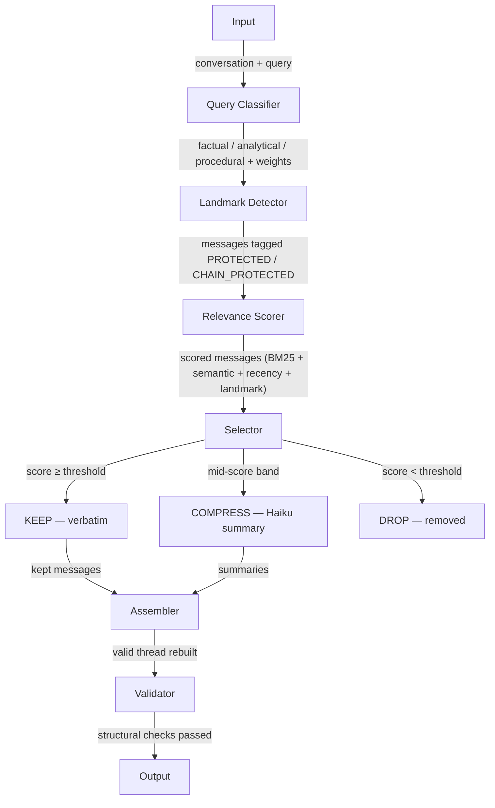

# Architecture Decisions Document
# Context Optimizer — LEC AI Assignment 3

---

## 1. Architecture Pattern

**Chosen: Multi-Stage Processing Pipeline (Pipeline and Filter Pattern)**

Data flows in one direction through a series of stages, each with a single responsibility:

### Why Pipeline and Not Alternatives

| Architecture | Why Rejected |
|---|---|
| **Hexagonal (Ports & Adapters)** | Designed for swappable external systems. We have one input, one output. Overkill. |
| **Event-Driven** | For async decoupled systems reacting to events. Our stages are sequential and synchronous — no branching, no event bus needed. |
| **Graph-Based (DAG)** | For when processing order depends on data. Our order is always fixed — every request follows the same path. |
| **Microservices** | Each component as a separate service. Massive operational overhead for a single-purpose pipeline with two endpoints. |
| **RAG Architecture** | Retrieves from external knowledge base. We optimise what's already in conversation history — different problem entirely. |

### Additional Patterns Used

- **Strategy Pattern** — Query Classifier selects different weight configurations at runtime based on query type (factual/analytical/procedural)
- **Guard Pattern** — Landmark Detector enforces invariants before scoring; Thread Validator enforces structural integrity after assembly

---

## 2. Technology Stack — Chosen vs Rejected

### FastAPI — API Framework

**Chosen over:** Flask, Django

FastAPI gives async request handling out of the box — important for parallelising Haiku compression calls across multiple clusters. Pydantic integration means request/response validation is automatic — malformed inputs get rejected before touching the pipeline. Flask is synchronous by default and requires extra libraries for async. Django adds ORM, sessions, and templating — dead weight for a two-endpoint API.

### sentence-transformers/all-MiniLM-L6-v2 — Embedding Model

**Chosen over:** OpenAI text-embedding-3-small, MPNet-base-v2, E5-large

Runs locally at zero cost with no API dependency or rate limiting. Batch encodes 50 messages in ~20ms on CPU. 384-dimensional vectors give reliable cosine similarity for general English conversation. OpenAI adds network latency and per-token cost. MPNet doubles inference time. E5-large triples it. Limitation: degrades on specialised jargon (legal, medical, financial) — acknowledged and on the roadmap.

### rank-bm25 — Keyword Scoring

**Chosen over:** TF-IDF, raw keyword counting

Two specific problems with raw keyword counting that BM25 solves. First, length normalisation — a short message entirely about the topic scores higher than a long message mentioning it once. Second, term frequency saturation — mentioning a keyword 10 times doesn't give 10x the score because marginal information value of repetition is near zero. Both problems appear constantly in conversational data with variable message lengths.

### Claude Haiku — Compression LLM

**Chosen over:** GPT-3.5-turbo, local Llama 3.1 8B

Cheapest Anthropic model (~$0.00025/1K input tokens). Already in the stack — no second API key, no second SDK, no second failure mode to handle. Local Llama degrades noticeably on 1-2 sentence summarisation quality. Haiku gives commercial-grade compression quality at near-local cost.

### Claude Sonnet — Evaluation Judge

**Chosen over:** GPT-4o, human evaluation

Better reasoning than Haiku for quality scoring. Consistent scoring across eval runs. Limitation: same model family as the compression LLM — potential circularity noted in the report. A more rigorous approach would use GPT-4o as judge.

### tiktoken — Token Counting

**Chosen over:** approximate character counting

Exact token counts using the same encoding (cl100k_base) that Claude models use. Critical for measuring reduction percentage accurately — character counting is inaccurate because tokens and characters don't have a fixed ratio.

### Stateless Design — No Redis, No PostgreSQL

**Chosen over:** Redis caching, persistent storage

The assignment requires a per-request pipeline, not cross-session persistence. Stateless systems are trivially horizontally scalable — run 10 instances behind a load balancer with zero coordination. Zero external dependencies means the repo runs with `pip install` only. In-memory compression cache (Python dict) gives caching benefit within a single process. Production upgrade: swap dict for Redis client — one line change.

---

## 3. Adaptive Scoring Strategy

Different query types get different scoring weights because they need different things from the context:

| Weight | Factual | Analytical | Procedural |
|---|---|---|---|
| α keyword (BM25) | 0.3 | 0.2 | 0.2 |
| β semantic (MiniLM) | 0.2 | 0.3 | 0.3 |
| γ recency (decay) | 0.2 | 0.2 | 0.3 |
| δ landmark (boost) | 0.3 | 0.3 | 0.2 |

**Factual queries** ("what did we decide about X") — keyword and landmark heavy, because the answer is likely in a specific decision message using exact vocabulary.

**Analytical queries** ("summarise our discussion") — semantic heavy, because we want broader topical coverage across the conversation, not just exact matches.

**Procedural queries** ("how do we deploy X") — recency heavy, because recent steps and instructions matter most for "how to" questions.

---

## 4. Selective Compression

Not all messages deserve the same compression treatment:

| Content Type | Detection | Compression |
|---|---|---|
| **Small talk** | "ok", "thanks", short messages | Aggressive — ≤15 words |
| **Reasoning** | "because", "however", "trade-off" | Light — ≤60 words, logic preserved |
| **Technical** | code, configs, dollar amounts | Detailed — ≤80 words, all specifics kept |

Pre-call checks prevent unnecessary API spend: clusters under 50 tokens get a local fallback, cache hits return instantly via SHA256 content hash, and a cost-aware check skips compression when Haiku cost exceeds downstream Sonnet savings.

---

## 5. Safety Nets

Six layers prevent catastrophic context loss:

| Safety Net | What It Catches |
|---|---|
| **Tail protection** | Last 5 messages always kept — immediate conversational context |
| **Landmark preservation** | Decisions, commitments, deadlines never dropped or compressed |
| **Pair preservation** | Kept question always has at least a compressed answer (and vice versa) |
| **Quality guardrail** | Minimum 35–38% token retention enforced — promotes top drops to KEEP |
| **Confidence fallback** | Low-confidence queries get expanded context (up to 5 extra messages) |
| **High-detail protection** | Messages with numbers, configs, code promoted from COMPRESS to KEEP |

---

## 6. Key Trade-offs Accepted

| Decision | Benefit | Cost |
|---|---|---|
| MiniLM local embeddings | Free, fast, no rate limits | Lower accuracy on specialised domains |
| BM25 over TF-IDF | Length normalisation, saturation | Negligible — no real downside |
| Rule-based landmark detection | Fast (<1ms), explainable, zero overhead | Misses ambiguous or domain-specific landmarks |
| Haiku for compression | Cheap, same stack, good quality | Small API cost per compression call |
| Stateless design | Simple, scalable, easy to test and deploy | No cross-request caching without Redis |
| Selective summarisation | Different prompts per content type | More complex compressor logic |
| Confidence-based fallback | Prevents catastrophic quality drops | Slightly reduces compression on edge cases |
| Sonnet as eval judge | Good reasoning, consistent scoring | Same model family as system being evaluated |

---

## 7. Cost Analysis

| Component | Cost |
|---|---|
| MiniLM + BM25 + recency | Free (local) |
| Haiku compression | ~$0.00043/call |
| Downstream Sonnet saving | ~$0.0045/query |
| **Net ROI** | **~10×** |

At 1,000 queries/day: ~$4/day net savings. Break-even only if conversation is under ~200 tokens — compression auto-skipped by the cost-aware check.

---

## 8. What Breaks at 500 Messages

| Problem | Why | Fix |
|---|---|---|
| MiniLM embedding time | 500 individual encodes = ~200ms | Batch encode all messages in one call → ~80ms |
| BM25 index rebuild | Rebuilds per request = ~50ms | Cache index keyed on conversation hash |
| Multiple Haiku calls | One call per cluster | Batch clusters into single call |
| Memory | 500 msgs × 384-dim embeddings = ~750KB | Fine per request; monitor under concurrency |

### Concurrency Concerns

MiniLM is not thread-safe by default — concurrent requests need thread pool executor via FastAPI's `run_in_executor`. Compression cache needs a lock for concurrent writes, or move to Redis. Cold start: MiniLM model loads in ~2 seconds at startup, not per request.

---

## 9. Production Monitoring

Three categories of metrics to track per request:

**Pipeline performance:** token_reduction_percent, assembly_latency_ms, compression_cost_usd, messages_kept/compressed/dropped ratios.

**Quality indicators:** landmarks_preserved count (should match total landmarks detected), thread_valid boolean, compression cache hit rate.

**Alerts:** trigger if average quality scores drop below threshold, if latency exceeds 500ms p95, or if compression cost per request exceeds savings.

All metrics are already computed by the pipeline and returned in the API response.
